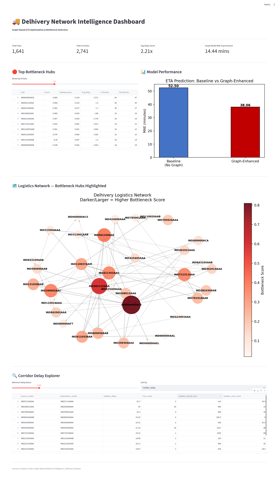

# Optimizing Delivery ETAs with Graph-Based Network Intelligence

**Summer Analytics 2026 | IIT Guwahati 
**Dataset:** Delhivery Logistics Network (141,725 trips)  
**Tech Stack:** Python, NetworkX, XGBoost, Streamlit, Pandas, Matplotlib

---

## 🚀 Project Overview

This project builds a **graph-based intelligence system** for Delhivery's logistics network — India's largest fully-integrated logistics provider. The entire delivery network is modeled as a directed graph where facilities are nodes and corridors are edges, to produce smarter ETA predictions, surface bottleneck hubs, and generate actionable recommendations for network operations.

**The Core Problem:** Delhivery's OSRM system underestimates actual delivery time by an average of **2.21x** across 94.2% of all corridors. This is not random noise — it is structurally driven by a small number of high-centrality hubs.

**The Solution:** A graph-based model that treats the logistics network as a connected graph, identifies structural bottlenecks, and produces ETAs that are **14.44 minutes more accurate** per trip than the baseline.

---

## 📊 Live Dashboard

🔗 **[Launch Live Dashboard](https://delivery-eta.streamlit.app)**



> Interactive dashboard showing real-time bottleneck scores, network visualization, model performance comparison, and corridor delay explorer.

**To run locally:**
```bash
streamlit run src/dashboard.py
```

---

## 🎯 Key Results

| Metric | Value |
|--------|-------|
| Network size | 1,641 hubs, 2,741 corridors |
| Corridors with >20% delay | 94.2% |
| Average delay factor | 2.21x (actual vs OSRM) |
| Baseline MAE | 52.50 minutes |
| Graph-Enhanced MAE | 38.06 minutes |
| MAE Improvement | **14.44 minutes (27% better)** |
| Trips within 15% accuracy | 46.90% → 58.53% **(+11.63%)** |
| FTL vs Carting classifier | **100% accuracy** |
| #1 Bottleneck Hub | IND000000ACB (score: 0.809, 92 connections) |

---

## 📁 Project Structure
delivery-eta-project/

├── data/

│   ├── delivery_data.csv              # Raw dataset (141,725 trips)

│   ├── clean_data.csv                 # Cleaned dataset

│   ├── corridor_stats.csv             # Per-corridor delay statistics

│   ├── logistics_graph.gexf           # Saved directed graph

│   └── hub_bottleneck_scores.csv      # Hub ranking with all metrics

├── notebooks/

│   ├── 01_eda.ipynb                   # Exploratory Data Analysis

│   ├── 02_graph_construction.ipynb    # Graph building & corridor analysis

│   ├── 03_bottleneck_analysis.ipynb   # Centrality & bottleneck ranking

│   ├── 04_eta_prediction.ipynb        # Baseline vs Graph-Enhanced model

│   └── 05_ftl_carting.ipynb           # FTL vs Carting decision framework

├── outputs/

│   ├── delay_distribution.png         # Delay ratio distribution

│   ├── top_hubs.png                   # Top source/destination hubs

│   ├── correlation_heatmap.png        # Feature correlation heatmap

│   ├── bottleneck_hubs.png            # Bottleneck hub rankings

│   ├── network_graph.png              # Logistics network visualization

│   ├── model_comparison.png           # Baseline vs graph model comparison

│   ├── ftl_carting_tradeoff.png       # FTL vs Carting delay analysis

│   └── dashboard_screenshot.png       # Streamlit dashboard

├── src/

│   └── dashboard.py                   # Streamlit interactive dashboard

├── memo/

│   └── network_operations_strategy_memo.md  # Final business deliverable

└── README.md

---

## 📓 Notebooks Summary

| Notebook | What it does | Key Output |
|----------|-------------|------------|
| 01_eda | Loads data, explores delay patterns, hub distributions | 94.2% corridors delayed |
| 02_graph_construction | Builds directed graph, identifies delayed corridors | 1,641 nodes, 2,741 edges |
| 03_bottleneck_analysis | Computes betweenness centrality, clustering coefficient, ranks bottleneck hubs | Tier 1 & 2 hub rankings |
| 04_eta_prediction | Trains baseline XGBoost vs graph-enhanced model | 27% MAE improvement |
| 05_ftl_carting | Builds route-type classifier, quantifies time-cost tradeoff | 100% classifier accuracy |

---

## 🔍 Top 5 Bottleneck Hubs

| Rank | Hub | Bottleneck Score | Connections | Avg Delay | Risk Level |
|------|-----|-----------------|-------------|-----------|------------|
| 1 | IND000000ACB | 0.809 | 92 | 1.57x | 🔴 Critical |
| 2 | IND562132AAA | 0.584 | 71 | 1.50x | 🔴 Critical |
| 3 | IND501359AAE | 0.392 | 57 | 1.70x | 🟠 High |
| 4 | IND160002AAC | 0.369 | 61 | 1.68x | 🟠 High |
| 5 | IND421302AAG | 0.357 | 58 | 1.78x | 🟠 High |

**IND000000ACB** sits on **22.9% of all shortest delivery paths** — the single most critical hub in the network.

---

## 🚛 FTL vs Carting Decision Framework

| Distance Band | Recommended Route | Avg Delay |
|--------------|-------------------|-----------|
| 0–50 km | Carting | 2.75x |
| 50–150 km | FTL preferred | 2.17x |
| 150–300 km | Carting competitive | 1.75x |
| 300 km+ | FTL exclusively | 1.89x |

---

## ⚙️ Setup & Installation

```bash
# Clone the repository
git clone https://github.com/I-M-Saurav/delivery-eta-project.git
cd delivery-eta-project

# Create virtual environment
python3 -m venv venv
source venv/bin/activate

# Install dependencies
pip install pandas numpy matplotlib seaborn networkx scikit-learn jupyter xgboost streamlit

# Run the dashboard
streamlit run src/dashboard.py
```


## 📝 Strategy Memo

See [`memo/network_operations_strategy_memo.md`](memo/network_operations_strategy_memo.md) for the full consulting deliverable including:
- Top 5 bottleneck hubs with SLA breach contribution
- Corridor-specific interventions
- Estimated 15–18% reduction in late deliveries
- 90-day action plan for operations team

---

*Summer Analytics 2026 | Graph-Based Network Intelligence | Delhivery Dataset | 141,725 trips analyzed*
